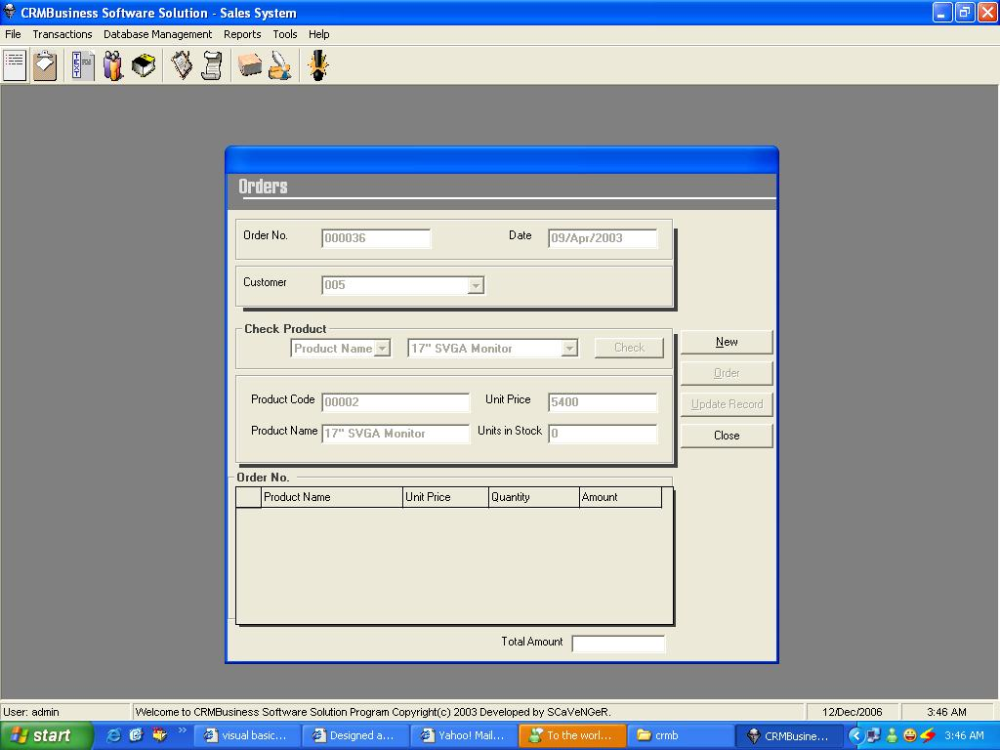



## CRMB Buisness Software Solution

### Description

Designed as a solution for business-to-business sales. Easy-to-access features include customer and supplier contact management, order processing, accepting delivery, constant product monitoring, user access setup and producing sales &amp; inventory management reports. It also provides easy-to-use menus and toolbar icons.
 
### More Info
 

             |
---                |---
**Submitted On**   |2003-04-17 12:03:02
**By**             |[Iftikhar Malik](https://github.com/Planet-Source-Code/PSCIndex/blob/master/ByAuthor/iftikhar-malik.md)
**Level**          |Intermediate
**User Rating**    |4.9 (83 globes from 17 users)
**Compatibility**  |VB 5\.0, VB 6\.0, VBA MS Access
**Category**       |[Databases/ Data Access/ DAO/ ADO](https://github.com/Planet-Source-Code/PSCIndex/blob/master/ByCategory/databases-data-access-dao-ado__1-6.md)
**World**          |[Visual Basic](https://github.com/Planet-Source-Code/PSCIndex/blob/master/ByWorld/visual-basic.md)
**Archive File**   |[CRMB\_Buisn20371412112006\.zip](https://github.com/Planet-Source-Code/iftikhar-malik-crmb-buisness-software-solution__1-67354/archive/master.zip)

